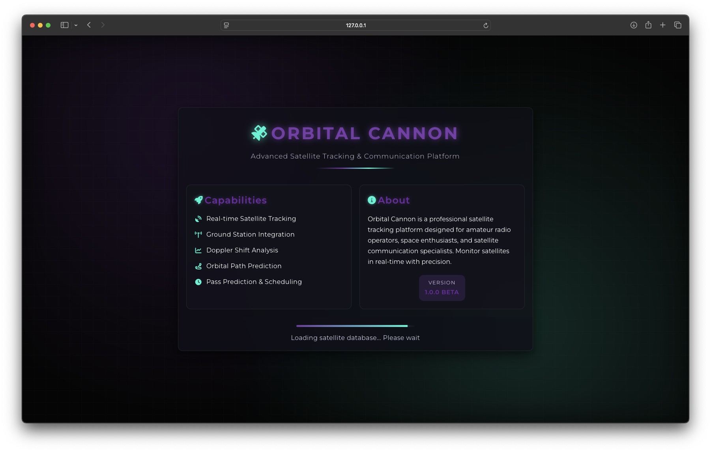
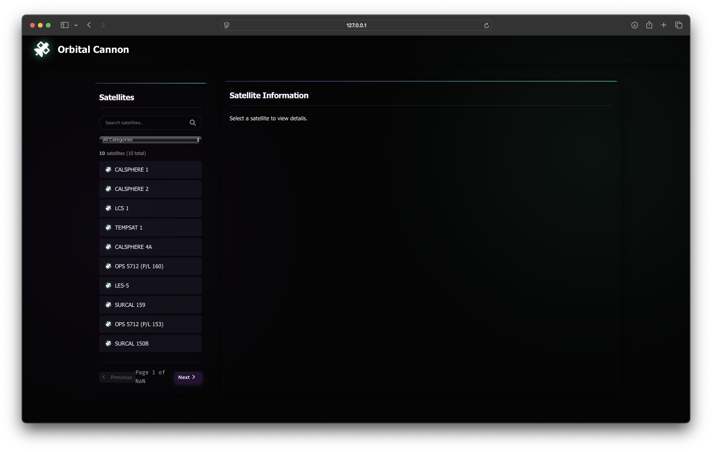
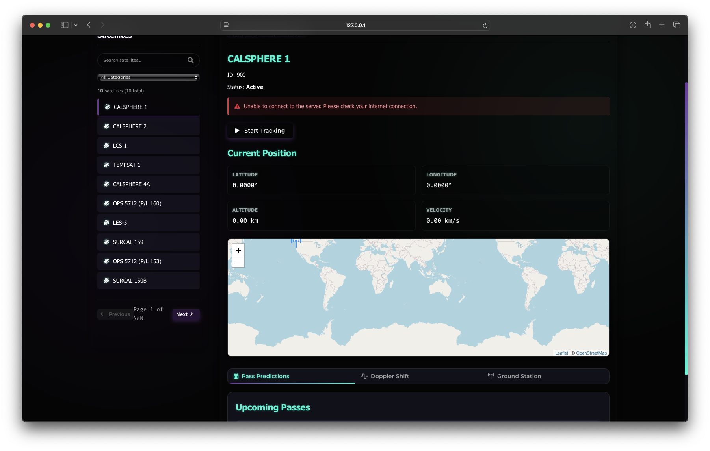
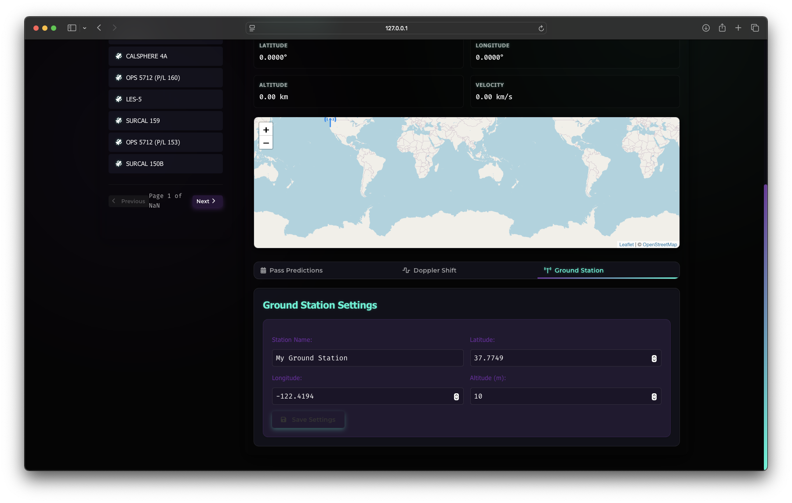

# 🛰️ Orbital Cannon

[](https://github.com/yourusername/Orbital-Cannon)
[](https://opensource.org/licenses/MIT)
[](https://www.python.org/)
[](https://flask.palletsprojects.com/)
[](https://github.com/yourusername/Orbital-Cannon/pulls)

**Orbital Cannon** is a sophisticated satellite tracking and orbital visualization platform that provides real-time tracking, pass prediction, and communication capabilities for satellite enthusiasts, amateur radio operators, and space professionals.



## ✨ Features

- **Real-time Satellite Tracking**: Monitor the positions of 18,700+ satellites from CelesTrak's database
- **Interactive Orbit Visualization**: See satellite orbits and footprints on an interactive map
- **Pass Prediction**: Calculate when satellites will be visible from your ground station
- **Doppler Shift Calculator**: Essential tool for amateur radio satellite communication
- **Glassmorphic Dark UI**: Professional interface with pitch black background and modern styling
- **Ground Station Configuration**: Set up your location for accurate pass predictions

## 📸 Screenshots

<table>
  <tr>
    <td></td>
    <td></td>
  </tr>
  <tr>
    <td colspan="2"></td>
  </tr>
</table>

## 🚀 Getting Started

### Prerequisites

- **Python 3.8+** 
- **pip** (Python package manager)
- Internet connection for fetching satellite data

### Installation

1. **Clone the repository**
   ```bash
   git clone https://github.com/yourusername/Orbital-Cannon.git
   cd Orbital-Cannon
   ```

2. **Create a virtual environment** (recommended)
   ```bash
   python -m venv venv
   
   # On Unix/Linux/macOS
   source venv/bin/activate
   
   # On Windows
   venv\Scripts\activate
   ```

3. **Install dependencies**
   ```bash
   pip install -r requirements.txt
   ```

4. **Run the application**
   ```bash
   python app.py
   ```

5. **Open your browser** and navigate to `http://localhost:8085`

## 📊 Architecture

### Backend (Python/Flask)

The Orbital Cannon backend is built with Python and Flask, providing:

- **API Endpoints**: RESTful endpoints for satellite data, positions, and pass predictions
- **Real-time Calculations**: Uses SGP4 propagator for accurate satellite position calculations
- **Data Management**: Caches TLE data from CelesTrak for offline use and fast response times
- **Pass Prediction**: Sophisticated algorithms to predict satellite passes for ground stations

### Frontend (HTML/CSS/JavaScript)

The frontend delivers a modern, responsive user interface with:

- **Interactive Mapping**: Powered by Leaflet.js for satellite visualization
- **Orbit Plotting**: Custom orbit visualization library for accurate path representation
- **Glassmorphic UI**: Modern design with glassy cards, purple and aqua accents
- **Data Management**: Pagination and search for handling large satellite datasets
- **Responsive Design**: Optimized for both desktop and mobile devices

## 📂 Project Structure

```
Orbital-Cannon/
├── app.py                           # Main Flask application
├── requirements.txt                 # Python dependencies
├── README.md                        # Project documentation
├── assets/                          # Screenshot and image assets
├── data/                            # Cached satellite data
└── orbital-cannon/
    └── static/                      # Frontend assets
        ├── index.html               # Main HTML page
        ├── styles.css               # CSS styles
        └── orbit-visualizer.js      # Orbit visualization library
```

## 📡 Data Sources

Orbital Cannon uses public TLE (Two-Line Element) data from:

- [CelesTrak](https://celestrak.org): Provides up-to-date satellite element sets for various categories:
  - Active satellites
  - Space stations
  - Visual satellites (easily visible)
  - Amateur radio satellites
  - Weather satellites
  - GPS/Navigation satellites
  - Starlink constellation

## 🧩 Core Features Explained

### Real-time Satellite Tracking

Orbital Cannon uses the SGP4 orbital propagator to calculate satellite positions based on TLE (Two-Line Element) data. This provides accurate position information including:

- Latitude and longitude
- Altitude
- Velocity
- Position and velocity vectors in TEME coordinates

### Satellite Pass Prediction

The pass prediction algorithm:

1. Calculates satellite positions at intervals over a specified time period
2. Determines visibility based on the user's ground station coordinates
3. Identifies periods when the satellite is above the minimum elevation
4. Calculates maximum elevation and duration for each pass

### Orbit Visualization

The custom orbit visualizer:

- Calculates future satellite positions based on current state vectors
- Handles both circular and elliptical orbits
- Draws the satellite footprint (coverage area) based on altitude
- Updates in real-time as the satellite moves

### Search and Filtering

With over 18,700 satellites in the database, Orbital Cannon provides:

- Server-side pagination for performance
- Real-time search by satellite name
- Category filtering by satellite type
- Fast response times through backend optimization

## 🎨 UI/UX Design

Orbital Cannon features a professional dark theme with:

- **Color Scheme**: Pitch black (#050505) background with deep purple (#9D4EDD) and neon aqua (#00F5D4) accents
- **Typography**: Montserrat for general text, Fira Code for monospaced technical data
- **Glassmorphism**: Semi-transparent cards with blur effects for a modern look
- **Ambient Effects**: Subtle grid background with glow effects
- **Interactive Elements**: Hover effects and subtle animations for enhanced user experience

## 🔧 Advanced Configuration

### Ground Station Setup

For accurate pass predictions, configure your ground station:

1. Navigate to the "Ground Station" tab in the satellite info panel
2. Enter your station name
3. Provide your latitude and longitude (decimal degrees)
4. Set your altitude above sea level (meters)
5. Click "Save Settings"

### Doppler Shift Calculation

For radio operators:

1. Select a satellite of interest
2. Navigate to the "Doppler Shift" tab
3. Enter your uplink/downlink frequencies
4. The system will calculate frequency shifts throughout the pass

## 🛠️ Development

### Local Development

To run the application in development mode:

```bash
python app.py
```

This starts the Flask server in debug mode, which:
- Auto-reloads when code changes
- Provides detailed error information
- Allows interactive debugging

### Satellite Data Updates

By default, TLE data is cached for 24 hours. To force a refresh:

1. Delete the `data/satellites.json` file
2. Restart the application

### Deployment Considerations

For production deployment:

- Use a proper WSGI server like Gunicorn or uWSGI
- Consider containerization with Docker
- Set up a reverse proxy with Nginx or Apache
- Implement HTTPS for secure connections

## 📝 License

This project is licensed under the MIT License - see the LICENSE file for details.

## 👥 Contributing

Contributions are welcome! Please feel free to submit a Pull Request.

1. Fork the repository
2. Create your feature branch (`git checkout -b feature/amazing-feature`)
3. Commit your changes (`git commit -m 'Add some amazing feature'`)
4. Push to the branch (`git push origin feature/amazing-feature`)
5. Open a Pull Request

## 📧 Contact

Project Owner - [your-email@example.com](mailto:your-email@example.com)

Project Link: [https://github.com/yourusername/Orbital-Cannon](https://github.com/yourusername/Orbital-Cannon)
